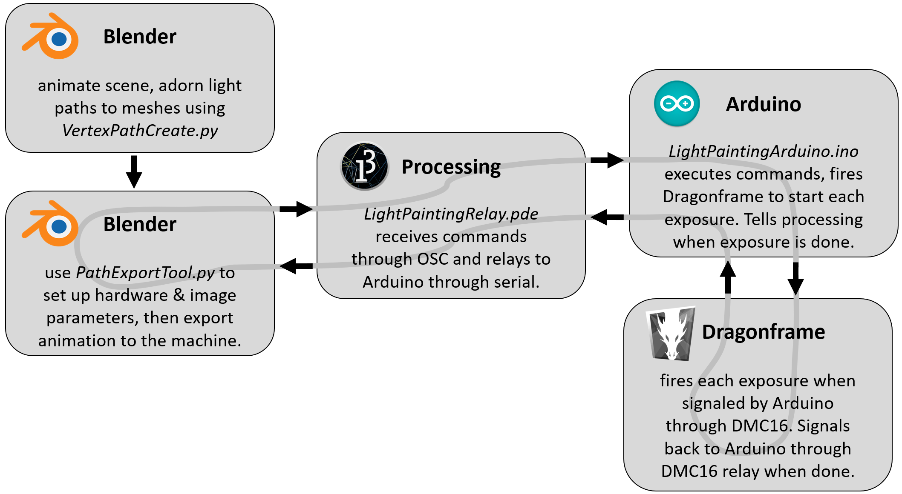
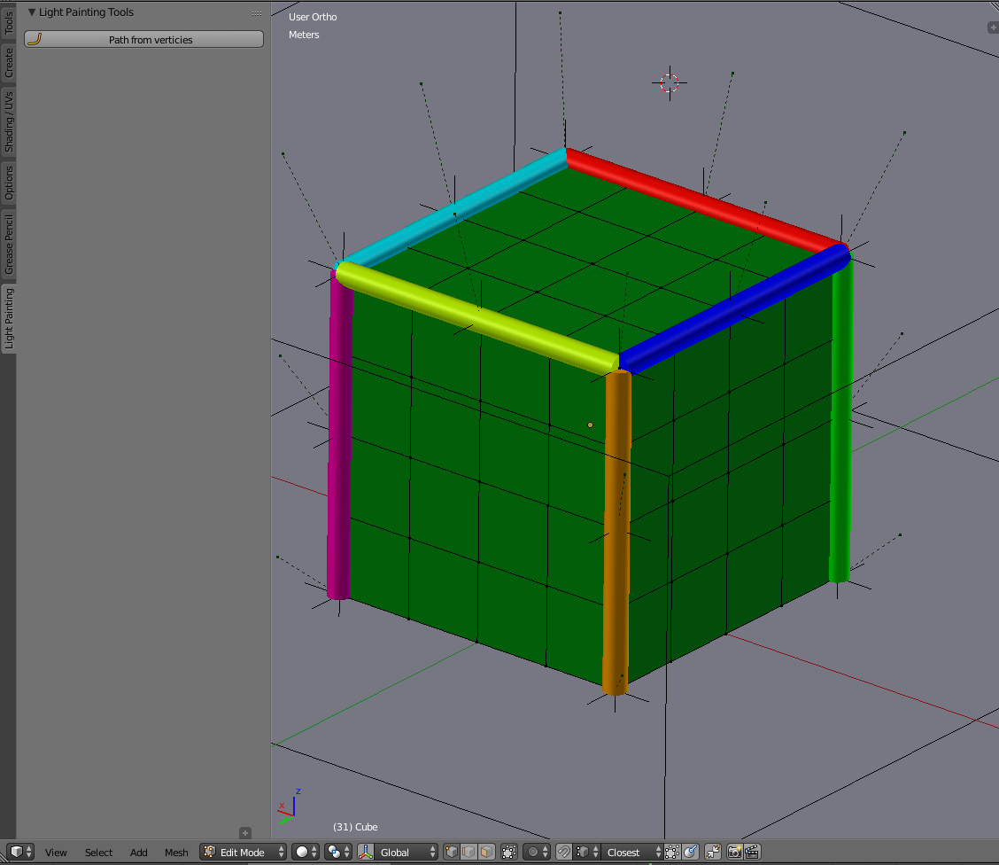
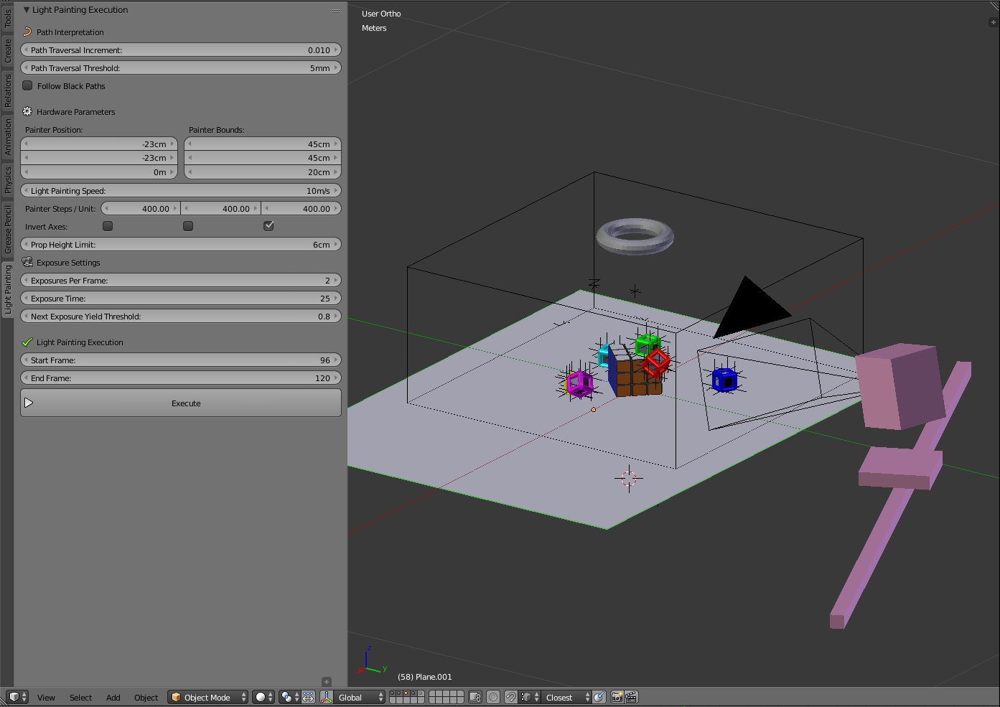
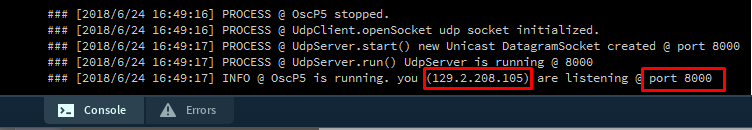
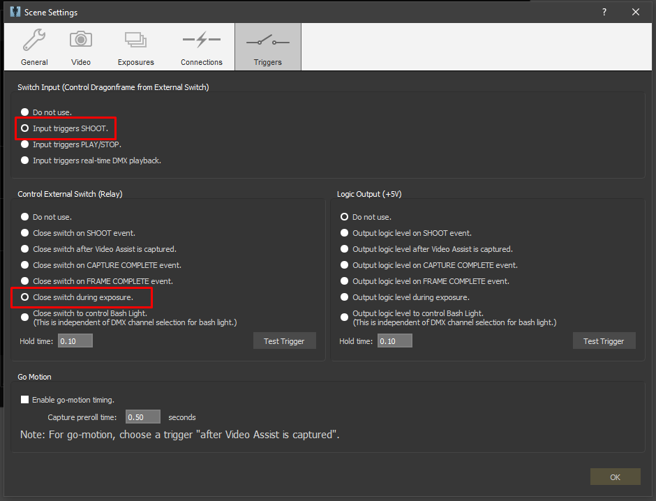

# LightPaintingMachine

This is the Blender, Processing, and Arduino code that enable use of a CNC light painting machine to make pretty pictures and animations. A basic outline of how this works is as follows:

* Light paths are defined and animated in Blender. _VertexPathCreate.py_ is a Blender addon that makes adorning path objects to animated meshes easy.
* _PathExportTool.py_ is another Blender addon that iterates through each frame of animation and converts the light paths into a command sequence that can be followed by the Arduino
* The commands are sent through OSC and received by _LightPaintingRelay.pde_, a Processing sketch which relays the commands through serial to the Arduino.
* The serial commands are received by the Arduino, running _LightPaintingArduino.ino_. The Arduino executes the command sequence.
* When finished, the Arduino indicates it is finished by sending a serial command to Processing, which relays it back to Blender through OSC.
* When _PathExportTool.py_ in Blender receives the finished command, it sends the command sequence for the next exposure. This loop continues until all exposures are complete.

**Using _VertexPathCreate.py_ to adorn light path objects to animated meshes**

Run _VertexPathCreate.py_ and enter edit mode to view the light path creation tool panel.

Click the button to enter the path creation state.

Select a series of verticies on the mesh and a path object will be generated, following the sequence of verticies you selected. Press finish or the enter key when you're done.

On the backend, this is automating the usually tedious process of creating empty objects attached to each vertex, creating a path that connects the verticies, and connecting the path to the empty objects using hook modifiers so that the path translates and deforms with the mesh.

_VertexPathCreate.py_ will automatically create a circle called _LightCircle_, which will be used as the bevel object for the light paths. You can change the size of this circle to change the diameter of the light paths. For accurate visual results, this should be set to the diameter of the light emitter on your machine.

_VertexPathCreate.py_ will also automatically create a material called _LightPathMaterial_ and assign the material of all created light paths to this material. Set up this material with no surface shader and an emission volume shader with a color of your choice. You can use different materials for each path, but it is important that each uses an emission shader because the color of this shader is used by _PathExportTool.py_ to send color commands to the machine.

**Operation Overview**

When you run _PathExportTool.py_, the light painting execution panel will appear in the tools pane when in object mode.

###### Paremeter setup

Before setting any paremeters, ensure that the unit of length in your Blender scene is set to your preference (use metric).

      

_Path Traversal Increment_ is the step increment used when converting light paths into a sequence of position commands. Each path will be traversed from 0 to 1 in steps of this paremeter. Generally the default value should be fine, for especially long paths a smaller value might be better.

_Path Traversal Threshold_ is the minimum distance from the current point on the path to the last recorded point for a new point to be recorded. As the path is traversed, a new point will be recorded when the distance to the last point is greater than this threshold. This is effectively a value of fidelity.
 
_Follow Black Paths_ will force the machine to follow paths that are black (invisible). These paths are normally ignored, but there are cases when you may want to force the machine to follow a black path to do manual obstacle avoidance where automatic obstacle avoidance does not suffice (more on this later).

An origin marker and bounding box that indicate the workspace of the machine will be created. Use the _Painter Bounds_ paremeter to match the size of the bounding box to the size of the physical machine, and use the _Painter Position_ paremeter to specify from where in the blender workspace the machine should operate.

_Light Painting Speed_ is how fast the machine will move. Generally this is a tradeoff between shoot time and machine vibration. Fast movement will often cause oscillation in the light, causing uneven, beady paths. Slower movement produces smoother paths.

_Invert Axes_ allows inversion of the X Y and Z axes. For my machine, the Z stage is operating upside down, so the Z axis is inverted.

_Prop Height Limit_ represents the Y position of the top of the tallest props in your scene. If you are not operating with the Z axis inverted, this would be the height of the bottom of your lowest props. This value is used in obstacle avoidance. If there is a prop in the way between the light position and the start of the next path, the light will retract to this height, move in the XY plane, and then drop down to the final position.

_Exposures Per Frame_ specifies how many exposures you want to divide each frame of animation into. This should be matched with the same number of exposures in Dragonframe.

_Exposure Time_ specifies the time of each exposure. This should be matched with the shutter speed in Dragonframe.

_Next Exposure Yield Threshold_ is a time value threshold. If the Arduino is not on the last exposure, it is about to move on to the next light path, and the time difference between the frame exposure time and the amount of time elapsed so far is less than this threshold, the Arduino will hold and wait to execute this path on the next exposure. In a scene with only short paths that can be drawn quickly, this value can be low. If there are long paths that take longer to draw, it is safer to keep this value higher. If the value is too low, a light path can get cut off by the end of the exposure and not be fully captured.

_Start Frame_ specifies the frame to start on.

_End Frame_ specifies the frame to end on.

###### Connecting Blender to Processing

Blender communicates with Processing through Open Sound Control (OSC).

Using OSC in Blender requires this Python library: https://github.com/sergeLabo/blenderOSC

Using OSC in Processing requires the oscP5 library by Andreas Schlegel. You can find it in Processing by searching for "oscP5" in the library manager, or here: http://www.sojamo.de/libraries/oscP5/

Start by running the _LightPaintingRelay.pde_ Processing sketch and checking the console.

   

Ensure that the IP adress and the port printed in the Processing console match the _ip_out_ and _port_out_ variables in the header of _PathExportTool.py_.

###### Connecting Processing to Arduino

Set the _PORT_NUM_ variable in the header of the Processing sketch to match the serial port number that the Arduino is connected to. This might take some trial and error, it's usually been 0 for me.

###### Connecting Arduino to Dragonframe

I recommend using a Dragonframe DMC16 or DDMX-512 to easily interface between Arduino and Dragonframe. If this is not an option, you may be able to hack together some other way to trigger Dragonframe, perhaps by hacking the enter key of a number pad. It would be harder to find a way to figure out communication from Dragonframe back to Arduino, so you might loose this functionality. You'd have to run Dragonframe open loop and just have the Arduino wait a set safe exposure time between each frame.

If using a DMC16 or DDMX-512, connect a relay to the _dragonframeActivate_ pin in the Arduino sketch, and connect this relay between SW and GND on the DMC16 or IN and GND on the DDMX-512. Connect the _dragonframeFinished_ pin to one of the two relay connections on either the DMC16 or DDMX-512, and connect the other relay connection to ground. Connect a pullup resistor to the _dragonframeFinished_ pin or use the INPUT_PULLUP pinmode if available.

   

In Dragonframe, set the input trigger to shoot, and set the relay to close during exposure.

 

**Incorporating motion control**

Motion control (or moco) will let you add camera movements and prop movements into your animations. For more info on how to create moco movements in Blender and export those movement to Dragonframe, check out this Blender addon: https://github.com/Defaultio/BlenderMoco/
